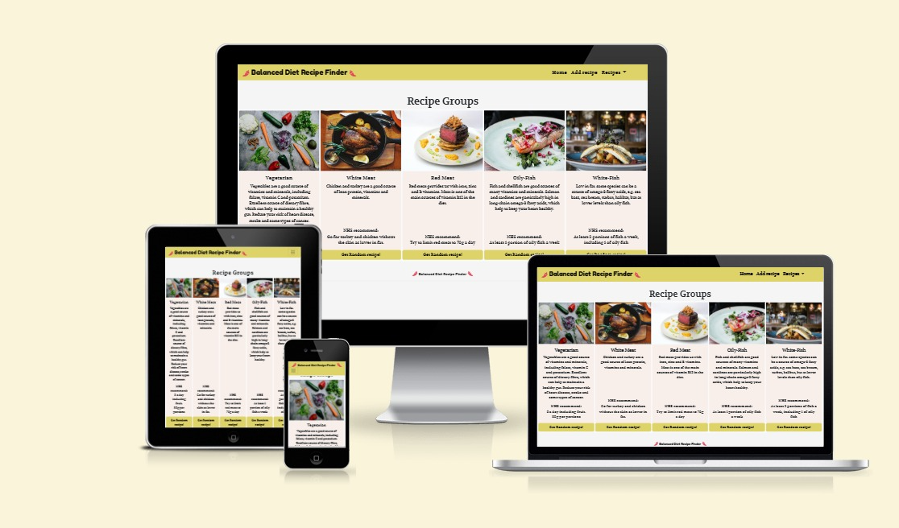
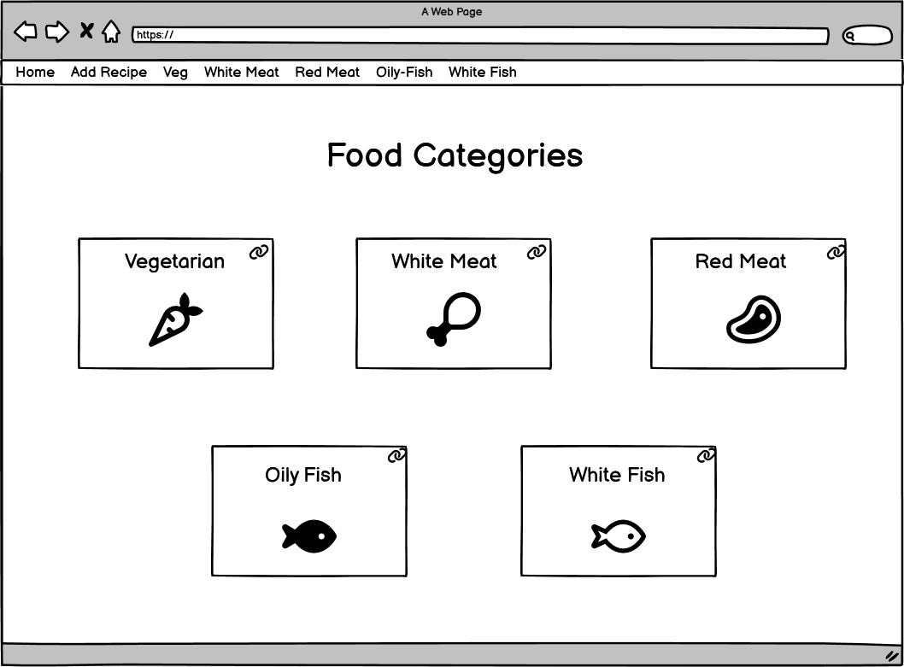
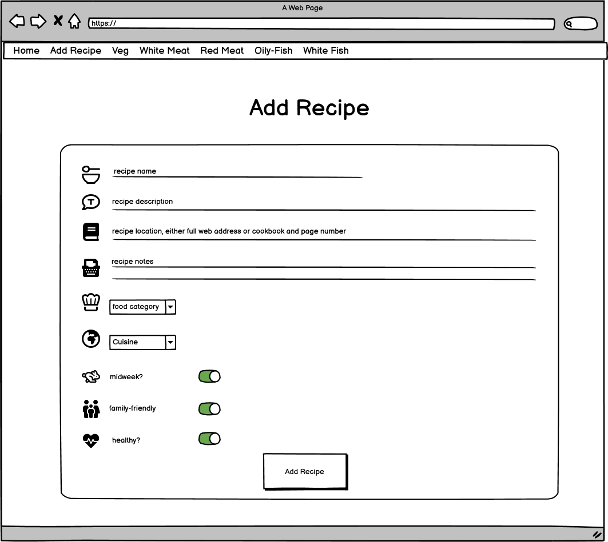
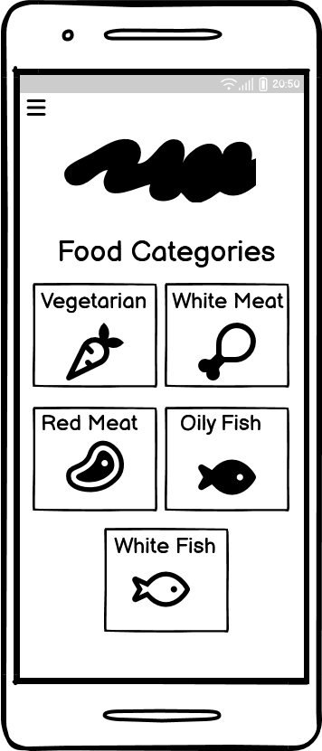
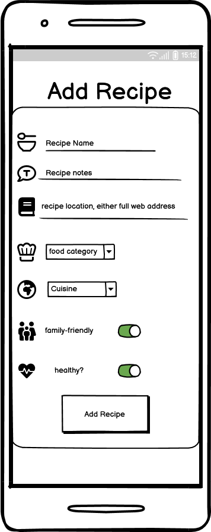

# [Balanced Diet Meal Finder](https://mealplanner-2.herokuapp.com/)



[View the live project here.](https://mealplanner-2.herokuapp.com/)

I love food.  I mean I *really* love it.

I love eating food, who doesnt? but also I love reading about it, I love learning about it and of course I love cooking it too.  As such I took it upon myself to devise a weekly meal plan for my small family and have been doing so for a while now.

I aim for the meals to be healthy, balanced, interesting and of course tasty!  Sounds simple right?  

But it's not... firstly it's very time consuming. 

I turn to my long tried-and-tested recipes which can be found either online, in my numerous cookbooks (which are in no-particular-order), 10 year old scraps of paper pulled from a sunday paper supplements (covered in sauce and flattened tomatoes) or finally, and more recently, in those free binders given to you on your first subscription to Gusto or Hello Fresh.  This all takes time. 

Also, with so much information around about what consists of a balanced, healthy, nutrious diet, it can feel confusing and overwhelming to say the least.  Who really knows if they're eating enough oily fish in their diet??

OK to summarise why I've created the Balanced Diet Meal Finder. 
- You have all your favourite recipes in one place, saving you time.
- Categorised into food groups. Vegetarian, White Meat, Red Meat, Oily Fish and White Fish to help you choose a nice balanced diet.

---

## User Experience (UX)

The project was created in order to fulfil the critera of the L5 Diploma in Web Application Development that I'm completing. This is for Unit 3: Back End Development.

The unit aims to provide knowledge and skills needed to build a Back end web application. Topics include data storage and data management using either relational or non-relational databases.

The idea came several years ago but then it was in paper form.  I had started to try and jot down any recipes our family enjoyed, categorised into different food groups. Essentially it was a plastic folder with dividers, separating several bits of paper all with the aim of saving me time, but also ensuring we eat a balanced diet.  

This units project criteria was the perfect opportunity to move the data (recipes) on to a user-friendly app!

### User Stories

"**_As a user, I would like to_** _____________________________"

:heavy_check_mark: *denotes items that have been successfully implemented*

- :heavy_check_mark: *view the site* from any device *(mobile, tablet, desktop)*.
- :heavy_check_mark: *view all recipes* as a user.
- :heavy_check_mark: *add* my own recipes.
- :heavy_check_mark: *edit* my own recipes.
- :heavy_check_mark: *delete* my own recipes.
- :heavy_check_mark: *view* a random recipe from a particular category.


### Design  

#### Colour Scheme

I wanted some vivid colours that come from produce so have I have used avocado green and reddish pinks that I feel compliment each other well.
-  `#DED369` (**Avocado Green**)
-  `#F8EFEA` (**Pink**)
-  `#E0475B` (**Coral**)

#### Typography

- I used [Google Fonts](https://fonts.google.com/) for my application. 

For the front page navbar brand header I used :-

- [Fredoka One](https://fonts.google.com/specimen/Fredoka+One)

For the food group headers, card texts and nav links I used :-

- [Volkhov](https://fonts.google.com/specimen/Volkhov)

#### Icons

- [Font Awesome 6.3.0](https://fontawesome.com/)
    - These where used for the chilli icons in the navbar and for the individual form fields.

### Wireframes

   **Large Screen Wireframes**




   **Mobile Screen Wireframes**




##  Features

1. Responsive on all device sizes

2. 
   

3. 


## Technologies Used

### Languages Used

-   [HTML5](https://en.wikipedia.org/wiki/HTML5)
-   [CSS3](https://en.wikipedia.org/wiki/Cascading_Style_Sheets)
-   [Javascript](https://en.wikipedia.org/wiki/JavaScript)

### Frameworks, Libraries & Programs Used

1.  [Bootstrap 5.3.0:](https://getbootstrap.com/docs/5.3/getting-started/introduction/)
    - Bootstrap was used to assist with the responsiveness and styling of the website.
1.  [Hover.css:](https://ianlunn.github.io/Hover/)
    - Hover.css was used on the Social Media icons in the footer to add the float transition while being hovered over.
1.  [Google Fonts:](https://fonts.google.com/)
    - Google fonts were used to import the 'Ranchers' and 'Monserrat' fonts into the style.css file.
1.  [GitHub:](https://github.com/)
    - GitHub is used to store the project's code after being pushed from Git.
1.  [Balsamiq:](https://balsamiq.com/)
    - Balsamiq was used to create the during the design process.
1.  [BrowserStack:](https://www.browserstack.com/docs/)
    - BrowserStack allowed manual testing of the site of all different browsers and devices. 
1.  [Unsplash:](https://unsplash.com/)
    - Unsplash provided a free resource for the photos used on the site.
1.  [Tinypng:](https://tinypng.com/)
    - Tinypng was used to compress the photos to improve site load times.

## Testing

### Manual Vs Automated Testing

- I opted to **manually** test my site.  The reasons are -  

    1. 
    2. 
    3. 
    4. 

- Reasons why I would use Automated Testing in the future for other projects.

    1. Larger scale site or application that may have multiple pages and an increased amount of functionality and code. Manual testing would take too long.
    2. Working in a team. Possibly no one person with in-depth knowledge of how the whole site should work and perform. Automated tests would allow anyone to run them.
    3. Continual code added to the site. Automated tests can be run after every addition, ensuring no disruption to the existing code.
    4. Higher accuracy. Important if the site is in the public domain and linked to an organisation. To avoid deprecation of the 'brand' due to a poor website.
    5. Time. Though they take longer to set up initially, having a bespoke automated testing process will save time in the long run, due to how frequently they need to be run when maintaining and improving the site.

### Validators

-   W3C Markup Validator complete without errors.
   

    
-   W3C CSS Validator complete without errors.
     

-   JS Hint Javascript Validator installed and showing no errors or warnings.
    -  
    - 
    - 

-   Lighthouse Accessibility.
    - Running at a score of  

    
    

-   Lighthouse Overall Performance.
   - Performance
   - Best Practices
   - SEO
    

### Testing User Stories from User Experience (UX) Section

-   ### User stories

    -   #### First-Time Visitor Goals

        1. As a First Time Visitor, I want to
          

        - 

        2. As a First Time Visitor, I want to
          

        -   
        - 
        - 

        3. As a First Time Visitor, I want to  
          

        - 

        - 


    -   #### Returning Visitor Goals

        1. As a Returning Visitor, I want to   
          

        2. As a Returning Visitor, I want to
        

        3. As a Returning Visitor, I want to  
        - 
        -  
          


    -   #### Frequent User Goals

        1. As a Frequent User, I want to 
        - 
        -  

        2. As a Frequent User, I want to
        - 
        -  
          

        3. As a Frequent User, I want to
        - 
        - 

### UX Manual Test process  

  - The Test  

- #### Outcomes

    Though the test is a little rudimentary it provided a lot of insight, watching people unfamiliar with the site trying to use it.  
    
  * The Good  

  * The Bad

  * Actions taken.  


### 10-point Manual Test process  

I used a programme called Browserstack to perform the tests. This is software provided as part of the course, included in the Student Developer pack.  

The application recommended that 1 x high-end, 1 x low-end device and a tablet is tested for each main manufacturer of smart devices.  I've tested Apple, Samsung, and Google.  

Also, I've tested the site on a broad cross-section of browsers.  Chrome, Edge, Safari and Firefox.  

Here are the devices/browsers and a screenshot of the front page of my site.  
  


The 10-points are as follows -   
Links  
1. 
2.   
3. 
4. 
5. 
6. 
7. 
8.  
9. 
10.   

A small selection of screenshots showing the cross-browser testing.  
Safari 16  
   
Samsung Tab8  
   
Samsung Ultra 22  
  
Ipad Pro 12.9 2022  
  


## Bugs
1. 
2. 
3. 
4. .  
  

5. 

## Fixes
1. 
2. 
3. 
4. 
5. 
6. 

   ### Known Bugs


## Deployment

### GitHub Pages

The project was deployed to GitHub Pages using the following steps...

1. Log in to GitHub and locate the [GitHub Repository](https://github.com/)
2. At the top of the Repository (not top of page), locate the "Settings" Button on the menu.
    - Alternatively, Click [Here](https://raw.githubusercontent.com/) for a GIF demonstrating the process starting from Step 2.
3. Scroll down the Settings page until you locate the "GitHub Pages" Section.
4. Under "Source", click the dropdown called "None" and select "Master Branch".
5. The page will automatically refresh.
6. Scroll back down through the page to locate the now-published site [link](https://github.com) in the "GitHub Pages" section.

### Forking the GitHub Repository

By forking the GitHub Repository we make a copy of the original repository on our GitHub account to view and/or make changes without affecting the original repository by using the following steps...

1. Log in to GitHub and locate the [GitHub Repository](https://github.com/)
2. At the top of the Repository (not top of page) just above the "Settings" Button on the menu, locate the "Fork" Button.
3. You should now have a copy of the original repository in your GitHub account.

### Making a Local Clone

1. Log in to GitHub and locate the [GitHub Repository](https://github.com/)
2. Under the repository name, click "Clone or download".
3. To clone the repository using HTTPS, under "Clone with HTTPS", copy the link.
4. Open Git Bash
5. Change the current working directory to the location where you want the cloned directory to be made.
6. Type `git clone`, and then paste the URL you copied in Step 3.

```
$ git clone https://github.com/YOUR-USERNAME/YOUR-REPOSITORY
```

7. Press Enter. Your local clone will be created.

```
$ git clone https://github.com/YOUR-USERNAME/YOUR-REPOSITORY
> Cloning into `CI-Clone`...
> remote: Counting objects: 10, done.
> remote: Compressing objects: 100% (8/8), done.
> remove: Total 10 (delta 1), reused 10 (delta 1)
> Unpacking objects: 100% (10/10), done.
```

Click [Here](https://help.github.com/en/github/creating-cloning-and-archiving-repositories/cloning-a-repository#cloning-a-repository-to-github-desktop) to retrieve pictures for some of the buttons and more detailed explanations of the above process.

## Credits

### Code

-   [Bootstrap5](https://getbootstrap.com/docs/5.0/examples/)   
The main structure is based on the Bootstrap5 Grid system.  
Buttons for styling and responsiveness  
-   [GoogleMap](https://www.google.co.uk/maps)  
The map to depict the location of the results.  
-   [JSHint](https://jshint.com/)  
Validating my Javascript code, cleaning it up and removing unnecessary semi-colons!


### Content

-  https://codepen.io/maheshambure21/pen/QwXaRw
  The navigation hover effect was taken from this site.  
-   All remaining content was written by the developer.


### Media

-   [Unsplash]( https://unsplash.com/)All photos used came from unsplash.  
-   [Font-Awesome](https://fontawesome.com/) Social media icons.

### Acknowledgements

-   My Mentor for continuous helpful feedback.

-   EKC course facilitator for introducing me to many new concepts and software and lots of great advice.