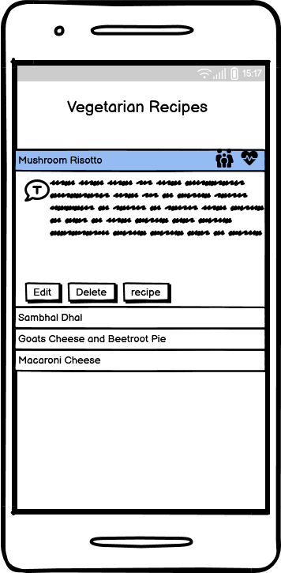

# [Balanced Diet Meal Finder](https://mealplanner-2.herokuapp.com/)


[View the live project here.](https://mealplanner-2.herokuapp.com/)

I love food.  I mean I *really* love it.

I love eating food, who doesnt? but also I love reading about it, I love learning about it and of course I love cooking it too.  As such I took it upon myself to devise a weekly meal plan for my small family and have been doing so for a while now.

I aim for the meals to be healthy, balanced, interesting and of course tasty!  Sounds simple right?  

But it's not... firstly it's very time consuming. 

I turn to my long tried-and-tested recipes which can be found either online, in my numerous cookbooks (which are in no-particular-order), 10 year old scraps of paper pulled from a sunday paper supplements (covered in sauce and flattened tomatoes) or finally, and more recently, in those free binders given to you on your first subscription to Gusto or Hello Fresh.  This all takes time. 

Also, with so much information around about what consists of a balanced, healthy, nutrious diet, it can feel confusing and overwhelming to say the least.  Who really knows if they're eating enough oily fish in their diet??

OK to summarise why I've created the Balanced Diet Meal Finder. 
- You have all your favourite recipes in one place, saving you time.
- Categorised into food groups. Vegetarian, White Meat, Red Meat, Oily Fish and White Fish to help you choose a nice balanced diet.

---

## User Experience (UX)

The project was created in order to fulfil the critera of the L5 Diploma in Web Application Development that I'm completing. This is for Unit 3: Back End Development.

The unit aims to provide knowledge and skills needed to build a Back end web application. Topics include data storage and data management using either relational or non-relational databases.

The idea came several years ago but then it was in paper form.  I had started to try and jot down any recipes our family enjoyed, categorised into different food groups. Essentially it was a plastic folder with dividers, separating several bits of paper all with the aim of saving me time, but also ensuring we eat a balanced diet.  

This units project criteria was the perfect opportunity to move the data (recipes) on to a user-friendly app!

### User Stories

"**_As a user, I would like to_** _____________________________"

:heavy_check_mark: *denotes items that have been successfully implemented*

- :heavy_check_mark: *view the site* from any device *(mobile, tablet, desktop)*.
- :heavy_check_mark: *view all recipes* as a user.
- :heavy_check_mark: *add* my own recipes.
- :heavy_check_mark: *edit* my own recipes.
- :heavy_check_mark: *delete* my own recipes.
- :heavy_check_mark: *view* a random recipe from a particular category.


### Design  

#### Colour Scheme

I wanted some vivid colours that come from produce so have I have used avocado green and reddish pinks that I feel compliment each other well.
-  `#DED369` (**Avocado Green**)
-  `#F8EFEA` (**Pink**)
-  `#E0475B` (**Coral**)

#### Typography

- I used [Google Fonts](https://fonts.google.com/) for my application. 

-For the front page navbar brand header I used :-

- [Fredoka One](https://fonts.google.com/specimen/Fredoka+One)

-For the food group headers, card texts and nav links I used :-

- [Volkhov](https://fonts.google.com/specimen/Volkhov)

#### Icons

- [Font Awesome 6.3.0](https://fontawesome.com/)
    - These where used for the chilli icons in the navbar and for the individual form fields.

### Wireframes

   **Large Screen Wireframes**

| | | 


   **Mobile Screen Wireframes**





## The Database

For the App the majority of the data is contained within the Recipe table.  The Category table is to allow separation of the recipes but is of course related to the main recipes.  The Cuisine table is there for future development, to allow filtration of the cuisine type of the recipe.


**Category**
```
id: <Integer>
food_category: <string>
```

**Cuisine**
```
id: <Integer>
recipe_cuisine: <String>
```

**Recipe**
```
id: <Integer>
recipe_name: <String>
recipe_notes: <Text>
cook_time: <Time>
recipe_location: <Text>
family_friendly : <Boolean>
recipe_healthy: <Boolean>
date_added: <Date>
category_id: <Integer>
cuisine_id: <Integer>

```


##  Features

1. Responsive on all device sizes

2. Add / Store a Recipe [**C**RUD]
- Use a form to direct the user to easily add a recipe. 
- Form looks for duplication and notifies via a flash message if duplicate exists.
- User to select a category via the dropdown to sort in to the correct recipe page.
- Once submitted the user is directed to the recipe page of the category chosen, allowing them to see the added recipe, along with a flash message to give immediate and full feedback on data processes.
   

3. Read / View a Recipe [C**R**UD] 
- Select via the Navbar food group of the recipe youre looking for. i.e Oily-fish
- See the time it takes to cook the recipe on the main header.
- Icons to allow user to quickly ascertain if the recipe is healthy or family-friendly, along with a key.
- When accordian card is open the user can view notes about the recipe, along with buttons to direct them to edit the recipe or delete it.
- If the location of the recipe is a URL then a button will be present which contains a link to the exteral webpage. If the recipe is in a cookbook or supplement then details such as cookbook and page number will be found here instead.
-From the home page / (categories.html) the user has the option to click on the 'Get Random recipe' button which selects a random recipe from that respective food group. Great if in a hurry or feeling indecisive!

4. Update/ Edit a Recipe [CR**U**D]
- Click on the edit button of the recipe to edit.
- Form loads with pre-populated information.
- Once 'Save Change' button clicked the user is directed to the page where the recipe is, along with a flash message giving immediate feedback its updated.

5. Delete a Recipe [CRU**D**]
- Click on the delete button of the recipe to delete it from the database.
- Defensive programming modal opens to confirm user wants to proceed with the deletion.
- If confirmaed the user is directed back to the page where the recipe was, along with a flash message giving immediate feedback its been deleted.

###  Features to impliment in the future

1. User login
- This would allow others to use it for their purpose with *their* favourite recipes.
- Users able to delete their own recipes and option to view only their recipes

2. Filter
- Users able to filter recipes by more than just food group.  Cuisine, Healthy or family friendly.  This is the reason I've added 'Cuisine' information on the database but as yet, not used.

3. Search
- Users to be able to search a specific ingredient.  


## Technologies Used

### Languages Used

-   [HTML5](https://en.wikipedia.org/wiki/HTML5)
-   [CSS3](https://en.wikipedia.org/wiki/Cascading_Style_Sheets)
-   [Javascript](https://en.wikipedia.org/wiki/JavaScript)
-   [Python](https://www.python.org/)


### Frameworks, Libraries & Programs Used

1. [Flask 2.2.3](https://flask.palletsprojects.com/en/2.2.x/)
    - Micro web framework use for the main build of the database-backed app.

1.  [Jinja](https://jinja.palletsprojects.com/en/3.1.x/)
    - Templating engine used to pass data to render final document. Used to write code similar to Python within the html documents.
1.  [SQLAlchemy 1.4.46](https://www.sqlalchemy.org/)
    - Toolkit used to allow use of Python language to complete SQL queries.
1.  [Psycopg2 2.9.5](https://pypi.org/project/psycopg2/)
    - PostgresSQL database adapter for Python.
1.  [ElephantSQL](https://www.elephantsql.com/)
    - To host my PostgreSQL databasee
1.  [Heroku-22](https://www.heroku.com/)
    - As the hosting platform for the App.
1.  [Bootstrap 5.3.0:](https://getbootstrap.com/docs/5.0/)
    - Bootstrap was used to assist with the responsiveness and styling of the website.
1.  [GitHub:](https://github.com/)
    - GitHub is used to store the project's code after being pushed from Git.
1.  [Balsamiq:](https://balsamiq.com/)
    - Balsamiq was used to create the initial wireframes during the design process.
1.  [BrowserStack:](https://www.browserstack.com/docs/)
    - BrowserStack allowed manual testing of the site of all different browsers and devices. 
1.  [Unsplash:](https://unsplash.com/)
    - Unsplash provided a free resource for the photos used on the site.
1.  [Tinypng:](https://tinypng.com/)
    - Tinypng was used to compress the photos to improve site load times.


### Validators

-  W3C Markup Validator complete without errors.


-   W3C CSS Validator complete without errors.
  

-   Code Institute Python Linter  showing no errors or warnings.


-   JSHint to Check Javascript. 2 Warnings about using 'let' of which I'm happy to ignore.


-   Lighthouse Overall Performance.
- Accessibility 98
- Performance 98
- Best Practices 83
- SEO 90  


## Testing

### Manual Vs Automated Testing

- I opted to **manually** test my site.  The reasons are -  

    1. As the sole developer I can quickly carry out tests as I go and can obtain immediate results from the test.
    2. As the main purpose of the site is to learn about Back End Development, show understanding and gain a qualification; and won't need to be maintained in the long term, I felt the time it would take to build an automated testing process was unnecessary on this occasion.  In a real-world situation, the use of a test framework, such as Jest would be invaluable to ensure the continiuous integrity of the site.
    3. UX testing. Important to the overall usability of the site and can only be carried out via manual testing. Automated testing lacks human observation and cognitive abilities.

- Reasons why I would use Automated Testing in the future for other projects.

    1. Larger scale site or application that may have an increased amount of functionality and code. Manual testing would take too long.
    2. Working in a team. Possibly no one person with in-depth knowledge of how the whole site should work and perform. Automated tests would allow anyone to run them.
    3. Continual code added to the site. Automated tests can be run after every addition, ensuring no disruption to the existing code.
    4. Higher accuracy. Important if the site is in the public domain and linked to an organisation. To avoid deprecation of the 'brand' due to a poor website.
    5. Time. Though they take longer to set up initially, having a bespoke automated testing process will save time in the long run, due to how frequently they need to be run when maintaining and improving the site.


### Manual Test process  

  - The Test  
    1. All navbar links work.
    2. Home/Category page loads a 'Random recipe' of the correct food category. Check all 5.
    3. All accordians work as expected across all 5 category html pages.
    4. 'Add recipe' page opens with form to complete and all fields work as expected
    5. 'Add recipe' button adds to the database and user is directed to the correct relevant recipe page, with feedback confirming the recipe has been added.
    6. Edit button opens the edit_recipe page with form pre-populated with existing information.
    7. 'Save Changes' button updates database with the changes made and user is directed to the correct, relevant page, with feedback confirming the recipe has been updated.
    8. Delete button produces a modal to confirm user wants to proceed. If selects ok the user receives feedback confirming the deletion.
    9. All pages work on different size screens, different browsers and devices

- #### Outcomes

I used a programme called Browserstack to perform the tests. This is software provided as part of the course, included in the Student Developer pack.  This software allows you to load your site on a live environment on each device and browser.

The application recommended that 1 x high-end, 1 x low-end device and a tablet is tested for each main manufacturer of smart devices.  I've tested Apple, Samsung, and Google.  

Also, I've tested the site on a broad cross-section of browsers.  Chrome, Edge, Safari and Firefox.

The site performed all across all devices and browsers. All links worked as expected.  Appearance and layout looked good on all devices too.


A small selection of screenshots showing the cross-browser testing.  
Windows 11  
   
Mac Big Sur 14.1  
   
Apple Iphone 14  
  
Samsung S21 Ultra  
  
Apple iPad Pro 11  
  


## Bugs
1. If a user incorrectly input 60mins or over in the minute field for the cook time a DataError was produced.

2. When editing a recipe the cook time wasnt pre-populating, remaining empty.
3. If user clicks on 'Get random recipe' button, though it worked the variable stored the recipe.  Meaning if the user clicked it over & over again it would show the same recipe. 
4.  When deploying my original app I ran in to a problem with the database.  It wasn't creating the database and linking to the app.  After many hours trying to resolve I copied over the code on to a new workspace and re-attempted the deployment.  Unfortunately my 'commits' will be linked to that original Repo ["mealplanner.2"](https://github.com/nddpj00/mealplanner.2)

## Fixes
1. The dataerror was due to using the incorrect datatype I believe.  In the form I chaned the type to "time" and this resolved it immediately.
2. The data stored in the database was in the incorrect format.  By added 0 before the value on the html resolved this. ie value="0{{ recipe.cook_time }}" .
3. I added some Javascript to reload the page on the 'close' button to allow a new recipe to be set as random.

### Known Bugs
No known bugs


## Deployment

### GitHub Pages

The project was deployed to GitHub Pages using the following steps...

1. Log in to GitHub and locate the [GitHub Repository](https://github.com/)
2. At the top of the Repository (not top of page), locate the "Settings" Button on the menu.
    - Alternatively, Click [Here](https://raw.githubusercontent.com/) for a GIF demonstrating the process starting from Step 2.
3. Scroll down the Settings page until you locate the "GitHub Pages" Section.
4. Under "Source", click the dropdown called "None" and select "Master Branch".
5. The page will automatically refresh.
6. Scroll back down through the page to locate the now-published site [link](https://github.com) in the "GitHub Pages" section.

### Forking the GitHub Repository

By forking the GitHub Repository we make a copy of the original repository on our GitHub account to view and/or make changes without affecting the original repository by using the following steps...

1. Log in to GitHub and locate the [GitHub Repository](https://github.com/)
2. At the top of the Repository (not top of page) just above the "Settings" Button on the menu, locate the "Fork" Button.
3. You should now have a copy of the original repository in your GitHub account.

### Making a Local Clone

1. Log in to GitHub and locate the [GitHub Repository](https://github.com/)
2. Under the repository name, click "Clone or download".
3. To clone the repository using HTTPS, under "Clone with HTTPS", copy the link.
4. Open Git Bash
5. Change the current working directory to the location where you want the cloned directory to be made.
6. Type `git clone`, and then paste the URL you copied in Step 3.

```
$ git clone https://github.com/YOUR-USERNAME/YOUR-REPOSITORY
```

7. Press Enter. Your local clone will be created.

```
$ git clone https://github.com/YOUR-USERNAME/YOUR-REPOSITORY
> Cloning into `CI-Clone`...
> remote: Counting objects: 10, done.
> remote: Compressing objects: 100% (8/8), done.
> remove: Total 10 (delta 1), reused 10 (delta 1)
> Unpacking objects: 100% (10/10), done.
```

Click [Here](https://help.github.com/en/github/creating-cloning-and-archiving-repositories/cloning-a-repository#cloning-a-repository-to-github-desktop) to retrieve pictures for some of the buttons and more detailed explanations of the above process.

## Credits

### Code

-   [Bootstrap5](https://getbootstrap.com/docs/5.0/examples/)   
The main structure is based on the Bootstrap5 Grid system.  
Buttons for styling and responsiveness  
-   [GoogleMap](https://www.google.co.uk/maps)  
The map to depict the location of the results.  
-   [JSHint](https://jshint.com/)  
Validating my Javascript code, cleaning it up and removing unnecessary semi-colons!


### Content

-  https://codepen.io/maheshambure21/pen/QwXaRw
  The navigation hover effect was taken from this site.  
-   All remaining content was written by the developer.


### Media

-   [Unsplash]( https://unsplash.com/)All photos used came from unsplash.  
-   [Font-Awesome](https://fontawesome.com/) Social media icons.

### Acknowledgements

-   My Mentor for continuous helpful feedback.

-   EKC course facilitator, Rachel Furlong for introducing me to many new concepts and software and lots of great advice.